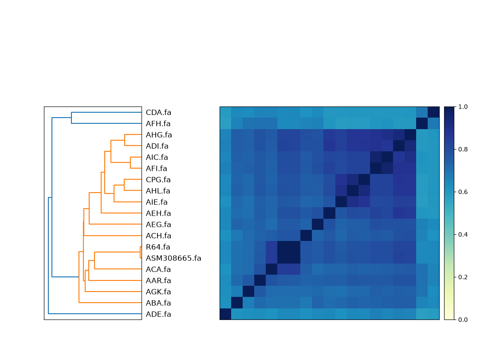
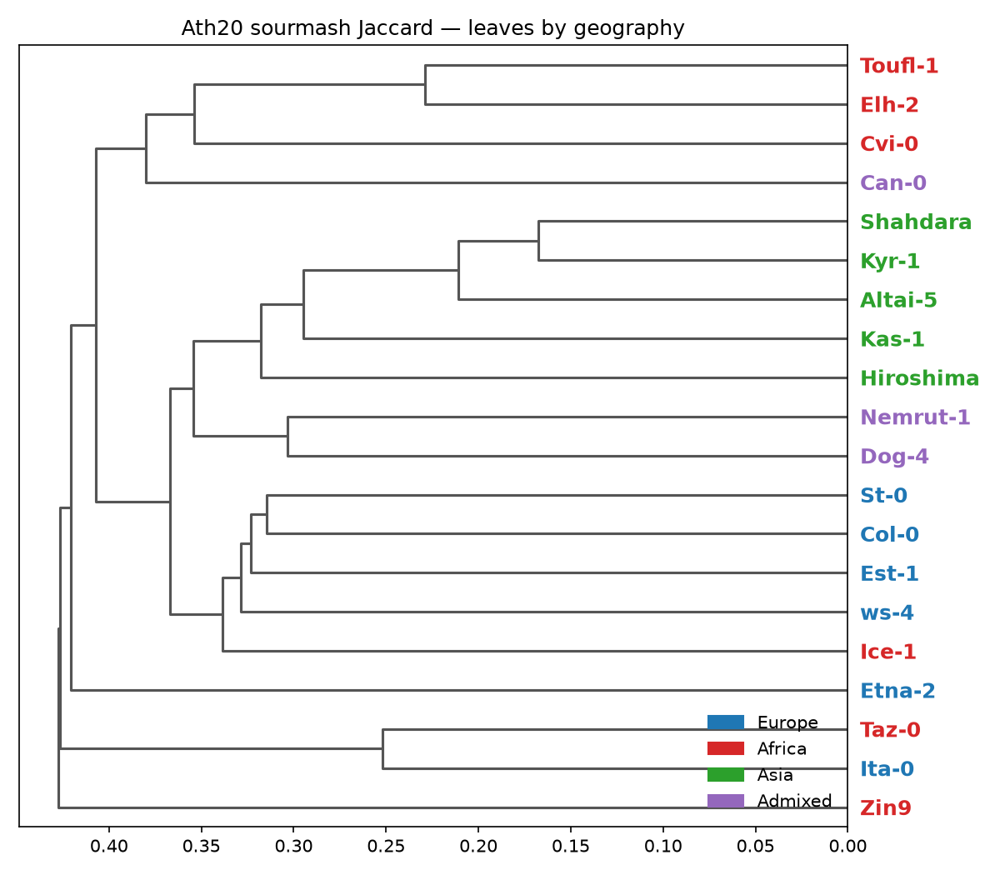
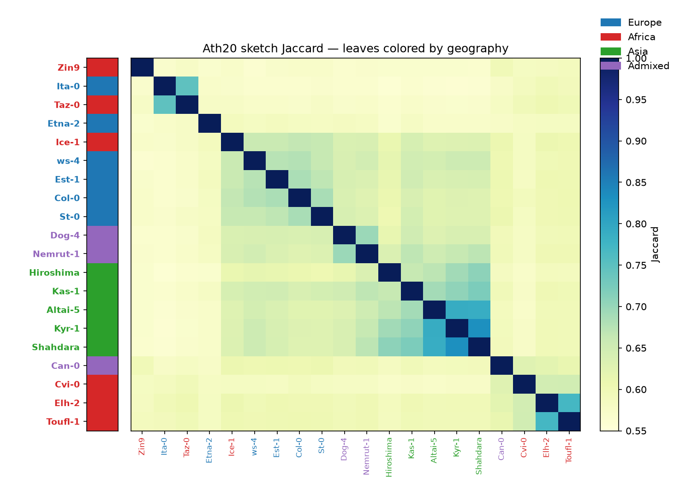

# Practical 3 - Sketching comparisons

Before building alignments or graphs, a common first pass on a genome collection is **sketching**: compress each assembly into a compact k-mer summary, then estimate all-pairs relatedness in seconds. That is the same idea behind [Mash](https://github.com/marbl/Mash) (Ondov et al., *Genome Biol* 2016; doi:[10.1186/s13059-016-0997-x](https://doi.org/10.1186/s13059-016-0997-x)). Here we use [sourmash](https://github.com/sourmash-bio/sourmash) (FracMinHash; Irber et al., *JOSS* 2024; doi:[10.21105/joss.06830](https://doi.org/10.21105/joss.06830)) as a Mash-family stand-in, and [dashing2](https://github.com/BenLangmead/dashing2) (Baker & Langmead, *Genome Biol* 2023; doi:[10.1186/s13059-023-02980-3](https://doi.org/10.1186/s13059-023-02980-3)) as a second sketch engine.

We reuse the **same 19 yeast chr14 assemblies** as Practical 4. Sketch distances are often turned into trees for ordering or visualisation (e.g. ntSynt-viz builds an NJ tree from Mash-like distances). Here that idea shows up as sourmash’s clustered heatmap + dendrogram — not a second tree-building tutorial.

**Collection:** chr14 from 19 yeast assemblies (O'Donnell et al., ScRAP; doi:[10.1038/s41588-023-01459-y](https://doi.org/10.1038/s41588-023-01459-y))

**Docker Image with all the tools pre-installed:** [npmalfoy/scalable:2026](https://hub.docker.com/r/npmalfoy/scalable) (`linux/amd64`)

**Course data (FTP):** [https://ftp.ebi.ac.uk/pub/databases/metagenomics/research-team/shivakumar/scalable_course/](https://ftp.ebi.ac.uk/pub/databases/metagenomics/research-team/shivakumar/scalable_course/)

> Expected runtimes below are from a dry-run on an Apple Silicon Mac (Docker `linux/amd64`). This chr14 set is tiny; full genomes sketch quickly too, but all-pairs still grows as \(O(n^2)\).
>
> Work top to bottom: copy each code block into the container and run it. You should not need to edit anything.

---

## Learning objectives

In this practical you will:

1. Sketch and compare 19 chr14 assemblies with sourmash (`sketch` → `compare` → `plot`)
2. Run an all-pairs dashing2 comparison and inspect the similarity table
3. Re-sketch with a few dashing2 settings (k, sketch size, multiset) and see what moves
4. Open two chr14s in [ModDotPlot Browser](https://marbl.github.io/ModDotPlot-Browser/) and spot an inversion
5. *(Optional)* Sketch 20 geographically diverse *A. thaliana* assemblies and colour the tree by region

---

## 0) Pull the docker container and datasets

Download `yeast_chr14.tar.gz` from the course [FTP directory](https://ftp.ebi.ac.uk/pub/databases/metagenomics/research-team/shivakumar/scalable_course/), unpack it, then start an interactive session with the working directory mounted at `/course`. If the download fails, ask a TA for the tarball, or reuse the extract from Practical 4 (`data/comp_pan/yeast_chr14/`).

```bash
# from your course working directory (the one you will mount at /course)
mkdir -p data/comp_pan
tar -xzf yeast_chr14.tar.gz -C data/comp_pan
ls data/comp_pan/yeast_chr14
```

```bash
docker pull npmalfoy/scalable:2026
docker run --rm -it --platform linux/amd64 -v "$PWD:/course" -w /course npmalfoy/scalable:2026
```

```bash
# Singularity / Apptainer alternative
apptainer pull scalable.sif docker://npmalfoy/scalable:2026
apptainer shell --bind "$PWD:/course" --pwd /course scalable.sif
```

> Use `singularity` in place of `apptainer` if that is what your cluster provides. On Apple Silicon (or other arm64 hosts), keep `--platform linux/amd64` for Docker.

```bash
which sourmash dashing2 agc
sourmash --version
dashing2 sketch -h | head
```

---

## 1) Setup — paths and FASTAs

[AGC](https://github.com/refresh-bio/agc) holds the 19 chr14 assemblies. Decompress them, then make short-named symlinks so plot labels stay readable (R64, ADI, …).

**Expect:** a few seconds; ~35 MiB RAM.

```bash
DATA=/course/data/comp_pan/yeast_chr14   # adjust if you unpacked elsewhere
OUT=/course/data/work/sketching
AGC=$DATA/yeast_chr14.agc
FASTA_DIR=$OUT/fastas
SHORT=$OUT/fastas_short

mkdir -p "$OUT" "$FASTA_DIR" "$SHORT"
```

```bash
agc info "$AGC"
agc getcol -o "$FASTA_DIR" "$AGC"
ls "$FASTA_DIR"/*.fa | wc -l   # expect 19

# short labels for sourmash / dashing2 (relative links → usable on host for ModDotPlot)
for fa in "$FASTA_DIR"/*.fa; do
  s=$(basename "$fa" .fa \
    | sed -E 's/^GCA_[0-9]+\.[0-9]+_//; s/[.].*//; s/_genomic$//; s/ASM308665v1/ASM308665/')
  ln -sfn "../fastas/$(basename "$fa")" "$SHORT/${s}.fa"
done
ls -l "$SHORT" | head
```

> Use **relative** symlinks (`../fastas/...`) so `$SHORT/ADI.fa` and `$SHORT/R64.fa` also work on the host for §5. Absolute `/course/...` links break outside the container.
>
> If you already extracted FASTAs for Practical 4, point `FASTA_DIR` at that folder and only rebuild `$SHORT`.

---

## 2) sourmash — sketch, compare, plot

[sourmash](https://sourmash.readthedocs.io/) sketches each FASTA (FracMinHash), estimates pairwise Jaccard similarity, then clusters the matrix. The usual workflow is `sketch` → `compare` → `plot`.

**Expect:** a few seconds; ~150–200 MiB RAM.

```bash
cd "$SHORT"
sourmash sketch dna -p k=31,scaled=1000 -o "$OUT/yeast.sig.zip" *.fa
cd "$OUT"

sourmash compare yeast.sig.zip -o yeast.cmp --csv yeast.cmp.csv
sourmash plot yeast.cmp --labels --output-dir "$OUT"

ls -la yeast.cmp.matrix.png yeast.cmp.dendro.png yeast.cmp.hist.png
```

Open `$OUT/yeast.cmp.matrix.png` on the host (under your mounted course directory). Which genomes cluster with R64? Which look most distant?

<details>
<summary>Example output (sourmash clustered matrix)</summary>



`sourmash plot` reorders genomes by hierarchical clustering. Cells are **Jaccard similarity** of FracMinHash sketches (1 = identical k-mer content at this `k`/`scaled`; darker blue ≈ closer). The dark diagonal is self-comparison. R64 and ASM308665 form a near-identical pair (~0.996); AFH and CDA sit farther from the main block (lighter cells).

</details>

**Checkpoint:** R64 and ASM308665 should be nearly identical (Jaccard ≈ 1). AFH and CDA tend to sit farther from the main group on this chr14 set.

---

## 3) dashing2 — default all-pairs

[dashing2](https://github.com/dnbaker/dashing2) can sketch and compare in one step. With `--cmpout`, it writes a human-readable pairwise table (header `#Sources`, upper triangle of similarities, `-` where empty).

**Expect:** under a second; ~20 MiB RAM.

```bash
( cd "$SHORT" && ls *.fa > "$OUT/fasta_short.list" )

cd "$SHORT"
dashing2 sketch -k 31 -S 1024 \
  -F "$OUT/fasta_short.list" \
  --cmpout "$OUT/d2_default.phy"
cd "$OUT"

head -n 5 "$OUT/d2_default.phy"

# which column is R64?
awk -F'\t' '/Sources/{for(i=2;i<=NF;i++) if($i ~ /R64/) print i-1, $i}' "$OUT/d2_default.phy"

# ADI / AFH rows (similarity to R64 is in the R64 column)
grep -E '^ADI\.fa|^AFH\.fa' "$OUT/d2_default.phy"
```

<details>
<summary>Example output (d2_default.phy format)</summary>

```text
#Sources   AAR.fa  ABA.fa  ...  ADI.fa  ...  AFH.fa  ...  R64.fa
ADI.fa     -       -       ...  -       ...  0.623   ...  0.817
AFH.fa     -       -       ...  -       ...  -       ...  0.674
R64.fa     -       -       ...  -       ...  -       ...  -
```

`#Sources` sets column order. The body is an **upper triangle** of sketch **similarities** in \([0,1]\) (higher = closer); `-` means empty / below the diagonal. If R64 is last, its **row** is all `-` — read R64–ADI from the **ADI** row’s R64 column (~0.82 here) and R64–AFH from the **AFH** row (~0.67). Same relatedness story as sourmash, different estimator.

</details>

---

## 4) dashing2 — try different sketch ideas

Sketch parameters change the estimated similarities. Re-run a few settings and compare the **same pairs** (R64–ADI, R64–AFH).

**Expect:** under a second each for k / sketch-size variants; `--multiset` a few seconds and ~220 MiB.

```bash
cd "$SHORT"

# 1) shorter k — more shared k-mers → similarities usually rise
dashing2 sketch -k 21 -S 1024 \
  -F "$OUT/fasta_short.list" --cmpout "$OUT/d2_k21.phy"

# 2) smaller sketch — noisier estimates
dashing2 sketch -k 31 -S 128 \
  -F "$OUT/fasta_short.list" --cmpout "$OUT/d2_S128.phy"

# 3) BagMinHash / multiset — uses k-mer counts (often a better match for assemblies)
dashing2 sketch -k 31 -S 1024 --multiset \
  -F "$OUT/fasta_short.list" --cmpout "$OUT/d2_multiset.phy"

# optional: Mash/Poisson distance instead of similarity (scale flips: near 0 = close)
dashing2 sketch -k 31 -S 1024 --mash-distance \
  -F "$OUT/fasta_short.list" --cmpout "$OUT/d2_mashdist.phy"

cd "$OUT"
```

<details>
<summary>Example values (R64–ADI across settings)</summary>

```text
default (k=31, S=1024)   ~0.82
k=21                     ~0.87   # more shared k-mers → higher similarity
S=128                    ~0.85   # smaller sketch → noisier
--multiset               ~0.81   # count-aware; a bit slower
--mash-distance          ~0.003  # distance scale: near 0 = close
```

R64–AFH stays clearly lower (~0.66–0.70) across similarity runs. Rank order of close vs distant pairs should stay broadly stable even when the numbers move.

</details>

**Questions to discuss:**

1. Which pairs stay closest across settings? Which look unstable when `-S` shrinks?
2. Why might `--multiset` be preferred for assemblies even when set-sketch is faster?
3. How does the sourmash dendrogram story compare to the dashing2 similarities?

---

## 5) ModDotPlot Browser — spot an inversion

Sketches summarise whole-sequence relatedness; they do **not** show rearrangements. For a quick structural view, open two chr14 FASTAs in the browser-based [ModDotPlot Browser](https://marbl.github.io/ModDotPlot-Browser/) ([user guide](https://github.com/marbl/ModDotPlot-Browser/blob/main/docs/USER_GUIDE.md)). Use **ADI** (little inverted signal vs this set) and **R64** (carries a ~24 kb inverted block on chr14 relative to ADI).

This step runs on the **host browser**, not inside Docker. From your course working directory on the host:

```text
data/work/sketching/fastas_short/ADI.fa
data/work/sketching/fastas_short/R64.fa
```

1. Open https://marbl.github.io/ModDotPlot-Browser/
2. Drop `ADI.fa` and `R64.fa` from `fastas_short/` on the FASTA target (plain FASTA is fine)
3. Click **Explore** → choose a **Pairwise** plot with ADI on one axis and R64 on the other
4. Set **Color → Direction** (forward vs reverse matches)
5. Zoom the off-diagonal **reverse** (pink) block — that is the inversion standing out against the forward diagonal

> The browser is for exploration. For publication-quality figures, use the [ModDotPlot CLI](https://github.com/marbl/ModDotPlot) (Sweeten et al., *Bioinformatics* 2024; doi:[10.1093/bioinformatics/btae493](https://doi.org/10.1093/bioinformatics/btae493)).

**Checkpoint:** Sketching said R64 and ADI are fairly close; the dot plot shows *where* they still differ structurally.

---

## 6) *(Optional)* Full-genome sketches — 20 *A. thaliana* assemblies

Chr14 was tiny. Same sourmash workflow on **whole assemblies**: 20 geographically diverse accessions from `athaliana_all.agc` ([Lian et al., 2024](https://doi.org/10.1038/s41588-024-01715-9); doi:[10.1038/s41588-024-01715-9](https://doi.org/10.1038/s41588-024-01715-9)). Pull the AGC from the course FTP (`datasets_agc.tar.gz`, same as Practicals 1–2), extract only these 20, sketch, then colour the tree by region.

**Expect:** ~1–1.5 min to sketch; extract / compare / colour a few seconds–1 min.

If you do not already have `datasets/athaliana_all.agc`, unpack on the host first:

```bash
# host (course working directory)
mkdir -p datasets
tar -xzf datasets_agc.tar.gz -C datasets
ls -lh datasets/athaliana_all.agc   # ~226 MiB
```

Paths and check:

```bash
ATH_AGC=/course/datasets/athaliana_all.agc
ATH_OUT=/course/data/work/sketching_ath20
ATH_FASTA=$ATH_OUT/fastas
ATH_SHORT=$ATH_OUT/fastas_short

mkdir -p "$ATH_FASTA" "$ATH_SHORT"
ls -lh "$ATH_AGC"
agc listset "$ATH_AGC" | wc -l   # expect 68
```

Write the sample list and extract the 20 sets:

```bash
cat > "$ATH_OUT/ath20.sets.tsv" <<'EOF'
Col-0	Europe	GCA_036942435.1_ASM3694243v1_genomic
Est-1	Europe	GCA_036936945.1_ASM3693694v1_genomic
St-0	Europe	GCA_036940715.1_ASM3694071v1_genomic
Ita-0	Europe	GCA_036942965.1_ASM3694296v1_genomic
Etna-2	Europe	GCA_036940335.1_ASM3694033v1_genomic
ws-4	Europe	GCA_036941295.1_ASM3694129v1_genomic
Cvi-0	Africa	GCA_036942575.1_ASM3694257v1_genomic
Taz-0	Africa	GCA_036941165.1_ASM3694116v1_genomic
Zin9	Africa	GCA_036941465.1_ASM3694146v1_genomic
Elh-2	Africa	GCA_036939995.1_ASM3693999v1_genomic
Ice-1	Africa	GCA_036940635.1_ASM3694063v1_genomic
Toufl-1	Africa	GCA_036942075.1_ASM3694207v1_genomic
Kas-1	Asia	GCA_036936845.1_ASM3693684v1_genomic
Shahdara	Asia	GCA_036927025.1_ASM3692702v1_genomic
Kyr-1	Asia	GCA_036937335.1_ASM3693733v1_genomic
Hiroshima	Asia	GCA_036937005.1_ASM3693700v1_genomic
Altai-5	Asia	GCA_036937475.1_ASM3693747v1_genomic
Dog-4	Admixed	GCA_036941915.1_ASM3694191v1_genomic
Nemrut-1	Admixed	GCA_036941985.1_ASM3694198v1_genomic
Can-0	Admixed	GCA_036927285.1_ASM3692728v1_genomic
EOF

while IFS=$'\t' read -r eco region set; do
  agc getset -o "$ATH_FASTA/${eco}.fa" "$ATH_AGC" "$set"
  ln -sfn "../fastas/${eco}.fa" "$ATH_SHORT/${eco}.fa"
done < "$ATH_OUT/ath20.sets.tsv"

ls "$ATH_SHORT"/*.fa | wc -l   # expect 20
```

Sketch, compare, plot (~1–1.5 min):

```bash
cd "$ATH_SHORT"
sourmash sketch dna -p k=31,scaled=1000 -o "$ATH_OUT/ath20.sig.zip" *.fa
cd "$ATH_OUT"

sourmash compare ath20.sig.zip -o ath20.cmp --csv ath20.cmp.csv
sourmash plot ath20.cmp --labels --output-dir "$ATH_OUT"

ls -la ath20.cmp.matrix.png ath20.cmp.dendro.png
```

Colour the tree and matrix by geography (paste as one block; do not edit):

```bash
python3 <<'PY'
import csv
from pathlib import Path
import numpy as np
import matplotlib.pyplot as plt
from matplotlib.patches import Patch
from scipy.cluster.hierarchy import linkage, dendrogram, leaves_list
from scipy.spatial.distance import squareform

out = Path("/course/data/work/sketching_ath20")
region = {}
with open(out / "ath20.sets.tsv") as f:
    for line in f:
        eco, reg, *_ = line.rstrip("\n").split("\t")
        region[eco] = reg

rows = list(csv.reader(open(out / "ath20.cmp.csv")))
labels = [x.split("/")[-1].replace(".fa", "") for x in rows[0]]
n = len(labels)
mat = np.array([[float(x) for x in rows[i + 1][:n]] for i in range(n)])
dist = np.clip(1.0 - mat, 0, None)
np.fill_diagonal(dist, 0)
dist = (dist + dist.T) / 2
Z = linkage(squareform(dist, checks=False), method="average")
order = leaves_list(Z)
labels_ord = [labels[i] for i in order]
mat_ord = mat[np.ix_(order, order)]

colors = {"Europe": "#1f77b4", "Africa": "#d62728", "Asia": "#2ca02c", "Admixed": "#9467bd"}
leaf_c = [colors[region[l]] for l in labels_ord]

fig, ax = plt.subplots(figsize=(8, 7))
dendrogram(Z, labels=labels, orientation="left", ax=ax,
           color_threshold=0, above_threshold_color="#555555")
ax.set_title("Ath20 sourmash Jaccard — leaves by geography")
for t in ax.get_yticklabels():
    t.set_color(colors[region[t.get_text().replace(".fa", "")]])
    t.set_fontweight("bold")
ax.legend(handles=[Patch(color=c, label=r) for r, c in colors.items()],
          loc="lower right", frameon=False)
fig.tight_layout()
fig.savefig(out / "ath20_dendro_by_region.png", dpi=150)

fig, axes = plt.subplots(
    1, 2, figsize=(10, 7),
    gridspec_kw={"width_ratios": [0.06, 0.94], "wspace": 0.05},
)
axc, axm = axes
axc.imshow(np.arange(n).reshape(-1, 1), aspect="auto",
           cmap=plt.matplotlib.colors.ListedColormap(leaf_c))
axc.set_xticks([])
axc.set_yticks(range(n))
axc.set_yticklabels(labels_ord, fontsize=9)
for i, t in enumerate(axc.get_yticklabels()):
    t.set_color(leaf_c[i]); t.set_fontweight("bold")
im = axm.imshow(mat_ord, cmap="YlGnBu", vmin=0.55, vmax=1.0, aspect="auto")
axm.set_xticks(range(n))
axm.set_xticklabels(labels_ord, rotation=90, fontsize=8)
axm.set_yticks([])
for t in axm.get_xticklabels():
    t.set_color(colors[region[t.get_text()]])
fig.colorbar(im, ax=axm, fraction=0.046, pad=0.04, label="Jaccard")
axm.set_title("Ath20 sketch Jaccard — leaves colored by geography")
fig.legend(handles=[Patch(color=c, label=r) for r, c in colors.items()],
           loc="upper right", bbox_to_anchor=(0.98, 0.98), frameon=False)
fig.tight_layout()
fig.savefig(out / "ath20_matrix_by_region.png", dpi=150)
print("wrote", out / "ath20_dendro_by_region.png")
print("wrote", out / "ath20_matrix_by_region.png")
PY

ls -la "$ATH_OUT"/ath20_*_by_region.png
```

Open the two PNGs on the host under `data/work/sketching_ath20/`.

<details>
<summary>Example output (coloured by geography)</summary>





**Asia (green)** forms a clear block. **Europe (blue)** has a Col-0 / Est-1 / St-0 / ws-4 core. **Africa (red)** is more split (Maghreb lines cluster; Zin9 / Taz-0 / Ice-1 sit farther out). **Admixed (purple)** Dog-4 / Nemrut-1 fall between Europe and Asia — close to the Lian et al. geography story, not a perfect four-colour partition.

</details>

**Checkpoint:** Sketch Jaccard recovers broad geography (especially Asia) without alignments — and you only needed the shared AGC, not new course FASTAs.

---

## Summary

- **sourmash:** `yeast.cmp.matrix.png` — clustered Jaccard heatmap + dendrogram
- **dashing2:** `d2_*.phy` — all-pairs similarity (or Mash distance) tables
- **ModDotPlot Browser:** pairwise ADI vs R64 in Direction mode (inversion)
- *(Optional)* **Ath20:** extract 20 sets from `athaliana_all.agc` → sourmash → colour by geography

Practical 4 looks at the **same** chr14 collection with MUMs, pairwise PAFs, and pangenome graphs — a slower but much richer view than sketches alone.
