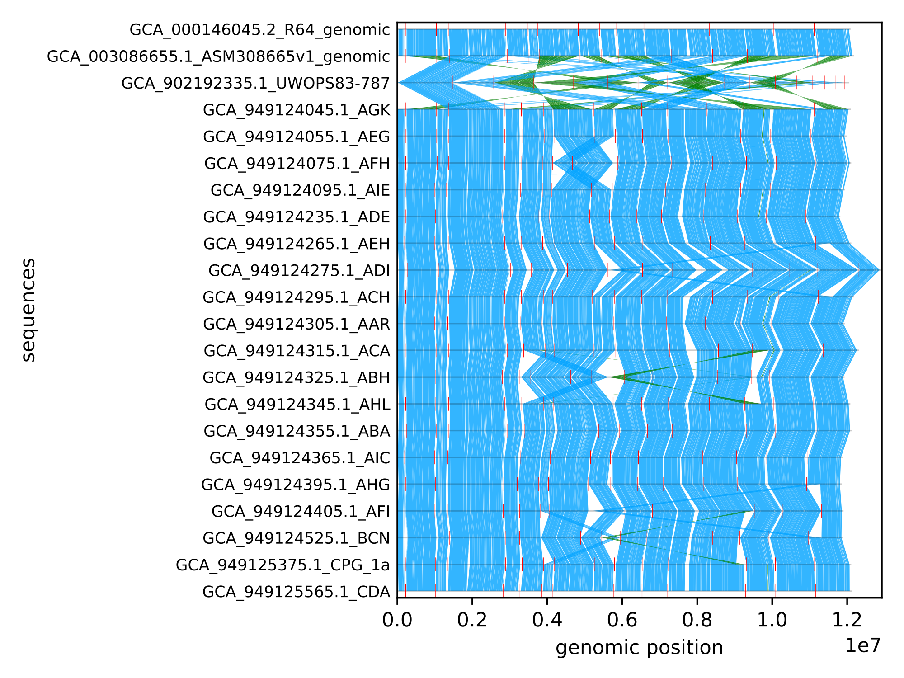

# Practical 4 - Comparative pangenomics

In this practical we compare several views of the **same** small pangenome example: chromosome XIV from 19 *S. cerevisiae* assemblies. 

We will explore different ways to underlying multiple alignment and pangenome synteny to explore the variation present across a collection of assemblies. You will look at exact sequence matches (mumemto), pairwise-alignment synteny (SVbyEye), and Bandage plots of the different pangenome graphs. We will also cover a different graph plotter called odgi, how multi-MUMs (and shared kmers) present in a graph, and ntSynt synteny detection using minimizers.

**Collection:** chr14 from 19 yeast assemblies (O'Donnell et al., ScRAP; doi:[10.1038/s41588-023-01459-y](https://doi.org/10.1038/s41588-023-01459-y));

**Docker Image with all the tools pre-installed:** [npmalfoy/scalable:2026](https://hub.docker.com/r/npmalfoy/scalable) (`linux/amd64`)

**Course data (FTP):** [https://ftp.ebi.ac.uk/pub/databases/metagenomics/research-team/shivakumar/scalable_course/](https://ftp.ebi.ac.uk/pub/databases/metagenomics/research-team/shivakumar/scalable_course/)

> Expected runtimes and memory below are rough guidelines from a dry-run on an Apple Silicon Mac (Docker `linux/amd64`). Your machine may differ. This chr14 bundle is small; real full-genome graphs are generally more compute heavy.

---

## Learning objectives

In this practical you will:

1. Decompress the chr14 assemblies from the shipped AGC archive
2. Visualise multi-MUM synteny and compute multi-MUM coverage on R64 chr14
3. Build a multi-genome synteny plot with SVbyEye from shipped pairwise PAFs (all 19 genomes)
4. Render the PGGB and minigraph-cactus chr14 graphs with BandageNG
5. *(Optional)* Install odgi in a temp env and paint multi-MUM intervals on the PGGB graph
6. *(Optional)* Run ntSynt + ntsynt-viz in a temporary conda env

---

## Preface: whole-genome synteny before the chr14 deep-dive

This practical focuses on a single chromosome (chr14), but it helps to first see what multi-MUM synteny looks like over the **full** *S. cerevisiae* collection — 22 assemblies, ~12 Mb each. Most tracks are largely collinear: conserved exact matches run as vertical ribbons between neighbouring genomes. A handful of assemblies look clearly “off” relative to the rest — denser crossings, pinched ribbons, or blocks that flip orientation. Red ticks mark contig boundaries, so fragmentation and contig order show up in the layout as well as in the ribbons.

**Warm-up:** open the plot below, pick out the aberrant assemblies, and ask what you can glean — misassemblies, shuffled contig order, orientation flips (especially at contig ends), or genuine structural variation between strains? Keep those questions in mind when you move to the cleaner, single-contig chr14 views in the sections that follow.

<details>
<summary>Multi-MUM synteny across 22 yeast genomes (<code>figures/yeast_synteny.pdf</code>)</summary>



[Open the PDF](figures/yeast_synteny.pdf) for a closer look (zoom helps for contig ticks and local crossings).

</details>

---

## 0) Pull the docker container and datasets

See the course informatics guide for full setup instructions. Download `yeast_chr14.tar.gz` from the course [FTP directory](https://ftp.ebi.ac.uk/pub/databases/metagenomics/research-team/shivakumar/scalable_course/), unpack it, then start an interactive session with the working directory mounted at `/course`.

**Unpack the data bundle** (creates a `yeast_chr14/` folder with the AGC, alignments, mumemto index, and GFAs — no FASTAs; those come from the AGC in §2):

```bash
# from your course working directory (the one you will mount at /course)
mkdir -p data/comp_pan
tar -xzf yeast_chr14.tar.gz -C data/comp_pan
ls data/comp_pan/yeast_chr14
```

**Docker:**

```bash
docker pull npmalfoy/scalable:2026
docker run --rm -it --platform linux/amd64 -v "$PWD:/course" -w /course npmalfoy/scalable:2026
```

**Singularity / Apptainer:**

```bash
apptainer pull scalable.sif docker://npmalfoy/scalable:2026

apptainer shell \
  --bind "$PWD:/course" \
  --pwd /course \
  scalable.sif
```

> Use `singularity` in place of `apptainer` if that is what your cluster provides. On Apple Silicon (or other arm64 hosts), keep `--platform linux/amd64` for Docker.

### Input layout

After unpacking, `$DATA` should look like:

```text
$DATA/   # e.g. /course/data/comp_pan/yeast_chr14
  yeast_chr14.agc              # 19 chr14 assemblies (decompress in §2)
  alignments/                  # pairwise *.paf (171 files)
  mumemto/
    mumemto.bumbl
    mumemto.bumbl.bi           # shredtools index (used in Practical 2)
    mumemto.lengths
  pggb/
    chr14_yeast.laced.gfa      # PGGB laced graph (P-lines)
  minigraph_cactus/
    chr14_yeast.full.gfa       # minigraph-cactus full graph (W-lines; RS:Z:R64)
```

Writable analysis outputs go under `$OUT` (e.g. `/course/data/work/comparative`). FASTAs from the AGC go under `$FASTA_DIR`.

To test that the core tools are available:

```bash
which agc mumemto BandageNG samtools
Rscript -e 'stopifnot(requireNamespace("SVbyEye", quietly=TRUE)); cat(as.character(packageVersion("SVbyEye")), "\n")'
```

---

## 1) Setup — paths

```bash
DATA=/course/data/comp_pan/yeast_chr14   # adjust to where you unpacked the bundle
OUT=/course/data/work/comparative
ANALYSIS_DIR=$OUT

AGC=$DATA/yeast_chr14.agc
FASTA_DIR=$OUT/fastas                  # write decompressed FASTAs here
ALIGN_DIR=$DATA/alignments
MUM_DIR=$DATA/mumemto
PGGB_GFA=$DATA/pggb/chr14_yeast.laced.gfa
MC_GFA=$DATA/minigraph_cactus/chr14_yeast.full.gfa

REF_FA=$FASTA_DIR/GCA_000146045.2_R64_genomic.fa
REF_MUM_IDX=0                    # first assembly in mumemto.lengths (= R64)
REF_CONTIG=BK006947.3            # R64 chrXIV

mkdir -p "$OUT" "$ANALYSIS_DIR" "$FASTA_DIR"

ls "$AGC" "$MUM_DIR" "$PGGB_GFA" "$MC_GFA"
ls "$ALIGN_DIR"/*.paf | wc -l    # expect 171
```

**Reference note:** R64 is mumemto index `0`, MC sample `R64` (`RS:Z:R64`), and PGGB path / FASTA contig `BK006947.3`.

---

## 2) Extract FASTAs from the AGC

[AGC](https://github.com/refresh-bio/agc) stores the 19 chr14 assemblies in one archive. Decompress them into `$FASTA_DIR` for later steps (ntSynt optional section, and general inspection).

**Expect:** <1 s; ~35 MiB RAM (`agc getcol`).

<details>
<summary>Show AGC commands</summary>

```bash
agc info "$AGC"
agc listset "$AGC" | head
agc getcol -o "$FASTA_DIR" "$AGC"
ls "$FASTA_DIR"/*.fa | wc -l   # expect 19
ls "$FASTA_DIR" | head
```

</details>

<details>
<summary>Example output (agc listset / FASTA listing)</summary>

```bash
agc listset "$AGC" | head
ls "$FASTA_DIR" | head
```

```text
GCA_000146045.2_R64_genomic
GCA_003086655.1_ASM308665v1_genomic
GCA_949124045.1_AGK.nuclear_genome.ScRAP_genomic
GCA_949124055.1_AEG.nuclear_genome.ScRAP_genomic
GCA_949124075.1_AFH.nuclear_genome.ScRAP_genomic
GCA_949124095.1_AIE.nuclear_genome.ScRAP_genomic
GCA_949124235.1_ADE.nuclear_genome.ScRAP_genomic
GCA_949124265.1_AEH.nuclear_genome.ScRAP_genomic
GCA_949124275.1_ADI.nuclear_genome.ScRAP_genomic
GCA_949124295.1_ACH.nuclear_genome.ScRAP_genomic

GCA_000146045.2_R64_genomic.fa
GCA_003086655.1_ASM308665v1_genomic.fa
GCA_949124045.1_AGK.nuclear_genome.ScRAP_genomic.fa
GCA_949124055.1_AEG.nuclear_genome.ScRAP_genomic.fa
GCA_949124075.1_AFH.nuclear_genome.ScRAP_genomic.fa
…
```

</details>

**Checkpoint:** Confirm R64 is present (`GCA_000146045.2_R64_genomic.fa`) and you have 19 FASTAs.

**Inputs / Outputs**


| Inputs | Outputs                      |
| ------ | ---------------------------- |
| `$AGC` | `$FASTA_DIR/*.fa` (19 files) |


---

## 3) Multi-MUM overview (mumemto)

We've computed multi-MUMs across the 19 chr14 sequences. For useful downstream analysis, multi-MUM coverage is often >50% on the reference; lower coverage usually means more dissimilar assemblies or high repeat content.

### 3a) Quick synteny viz

`-i` is an **input prefix** (`…/mumemto` → `mumemto.bumbl` + `mumemto.lengths`), not a path to the `.bumbl` alone.

**Expect:** ~1–2 s; ~120 MiB RAM.

<details>
<summary>Show mumemto viz command</summary>

```bash
mumemto viz -o "$ANALYSIS_DIR/mumemto.pdf" -i "$MUM_DIR/mumemto" --mode gapped
```

</details>

<details>
<summary>Example output (multi-MUM gapped synteny)</summary>


</details>

> These chr14 FASTAs are single-contig each, so gapped mode should keep a clean per-assembly layout. If contig counts differ, mumemto may fall back to delineated mode.

**Checkpoint:** Open the PDF. How collinear is chr14 across strains? Where does synteny look messy?

### 3b) Multi-MUM coverage on R64

Coverage for sequence index `0` (R64). The percentage line is written to **stderr** — redirect with `2>&1`.

**Expect:** ~2 s; ~220 MiB RAM.

```bash
mumemto coverage -i "$MUM_DIR/mumemto" -s "$REF_MUM_IDX" 2>&1 | tee "$ANALYSIS_DIR/mumemto_coverage.txt"
# dry-run: seq0: 81.814%
```

<details>
<summary>Example output (mumemto_coverage.txt)</summary>

```text
seq0: 81.814%
```

</details>

### 3c) Multi-MUM intervals as BED

Export MUM intervals on R64 for later colouring. Pass the **`.bumbl`** (path must end in `.bumbl` or `.mums`) and the lengths file. Use **`-v`** with this mumemto build when there are no collinear blocks (otherwise the BED can be empty). Default **`-L 100`** keeps MUMs ≥ 100 bp:

**Expect:** <1 s; ~60 MiB RAM. Dry-run BED: **1970** intervals.

```bash
mumemto bed -v \
  -s "$REF_MUM_IDX" \
  -l "$MUM_DIR/mumemto.lengths" \
  -o "$ANALYSIS_DIR/r64_multimum.bed" \
  "$MUM_DIR/mumemto.bumbl"

wc -l "$ANALYSIS_DIR/r64_multimum.bed"
head -5 "$ANALYSIS_DIR/r64_multimum.bed"
```

<details>
<summary>Example output (r64_multimum.bed)</summary>

```bash
wc -l "$ANALYSIS_DIR/r64_multimum.bed"
head -5 "$ANALYSIS_DIR/r64_multimum.bed"
```

```text
1970 …/r64_multimum.bed
BK006947.3	15779	15892	mum_26	+
BK006947.3	17924	18045	mum_67	+
BK006947.3	18055	18179	mum_68	+
BK006947.3	18180	18305	mum_69	+
BK006947.3	18355	18501	mum_71	+
```

</details>

**Checkpoint:** Coverage in §3b is over all MUMs. The BED with default `-L 100` is a stricter subset (short MUMs filtered). Optional: `mumemto bed -v -L 0 …` if you want BED coverage to match §3b.

**Inputs / Outputs**


| Inputs                          | Outputs                              |
| ------------------------------- | ------------------------------------ |
| `$MUM_DIR/mumemto` (+ `.bumbl`) | `$ANALYSIS_DIR/mumemto.pdf`          |
| same                            | `$ANALYSIS_DIR/mumemto_coverage.txt` |
| `.bumbl` + `.lengths`           | `$ANALYSIS_DIR/r64_multimum.bed`     |


---


## 3d) *(Temporary)* MUM coverage and graph compression

> **Cut-able:** this subsection is for discussion / dry-run. Delete it from the shipped practical if you want to keep the main path shorter.

Multi-MUM coverage tells you how much of each assembly is “shared exact sequence” that a pangenome *could* store once. Graphs go further (they also collapse near-identical and branching structure), so GFA sequence totals are usually **smaller** than a naive MUM-only lower bound.

**Expect:** a few seconds; <0.5 GB RAM.

<details>
<summary>Show compression commands</summary>

```bash
# Total sequence across all assemblies + per-FASTA lengths
TOTAL=$(awk 'BEGIN{n=0} /^>/ {next} {n+=length($0)} END{print n}' "$FASTA_DIR"/*.fa)
LREF=$(awk 'BEGIN{n=0} /^>/ {next} {n+=length($0)} END{print n}' "$REF_FA")

# GFA stored sequence = sum of lengths of S-line sequence fields
PGGB_S=$(awk -F'\t' '$1=="S"{s+=length($3)} END{print s+0}' "$PGGB_GFA")
MC_S=$(awk -F'\t' '$1=="S"{s+=length($3)} END{print s+0}' "$MC_GFA")

# Multi-MUM coverage fraction on R64 (stderr → capture)
C=$(mumemto coverage -i "$MUM_DIR/mumemto" -s "$REF_MUM_IDX" 2>&1 \
      | awk -F'[: %]+' '/seq/{print $2/100}')

# Lower bound: keep ONE copy of MUM sequence (≈ C × L_ref) and store ALL
# inter-MUM regions uncollapsed for every genome:
#   lower_bound = C*L_ref + Σ_i max(L_i − C*L_ref, 0)
python3 - "$FASTA_DIR" "$TOTAL" "$LREF" "$C" "$PGGB_S" "$MC_S" <<'PY'
import pathlib, sys
fasta_dir, total, lref, c, pggb, mc = sys.argv[1:7]
total, lref, c = int(total), int(lref), float(c)
pggb, mc = int(pggb), int(mc)
lens = []
for f in sorted(pathlib.Path(fasta_dir).glob("*.fa")):
    n = 0
    for line in open(f):
        if line.startswith(">"):
            continue
        n += len(line.strip())
    lens.append((n, f.name))
longest = max(lens)[0]
shared = c * lref
lb = shared + sum(max(L - shared, 0) for L, _ in lens)
print(f"total_fasta_bp\t{total}")
print(f"longest_assembly_bp\t{longest}\t{max(lens)[1]}")
print(f"L_ref_bp\t{lref}")
print(f"mum_coverage_C\t{c}")
print(f"shared_mum_once_bp\t{shared:.0f}")
print(f"lower_bound_bp\t{lb:.0f}")
print(f"pggb_S_bp\t{pggb}")
print(f"mc_S_bp\t{mc}")
print(f"compress_fasta_vs_pggb\t{total/pggb:.3f}x")
print(f"compress_fasta_vs_mc\t{total/mc:.3f}x")
print(f"compress_fasta_vs_lower_bound\t{total/lb:.3f}x")
print(f"pggb_S_vs_longest\t{pggb/longest:.3f}x")
print(f"mc_S_vs_longest\t{mc/longest:.3f}x")
PY
```

</details>

<details>
<summary>Example output (dry-run numbers)</summary>

```text
total_fasta_bp                  14,930,447
longest_assembly_bp               828,344   (ACH)
L_ref_bp (R64)                    784,333
mum_coverage_C (R64)               0.81814   → shared MUM once ≈ 641,694 bp
lower_bound_bp                  3,379,951   (≈ 4.42× vs total FASTA)
pggb_S_bp                       1,131,929   (≈ 13.19× vs total FASTA; 1.37× longest)
mc_S_bp                         1,177,292   (≈ 12.68× vs total FASTA; 1.42× longest)
```

Interpretation: both graphs store **more** sequence than the single longest assembly, but **far less** than 19× chr14. The MUM-only lower bound (~3.4 Mb) is still ~3× larger than the GFA S totals — graphs collapse more than exact multi-MUMs alone.

> Note: the §3c BED (`-L 100`) covers only ~42.5% of R64; §3b coverage (all MUMs) is the right input for this bound.

</details>

**Checkpoint:** Why can the GFA beat the MUM lower bound? Where would you expect the bound to be tight vs loose?


---

## 4) Whole-collection synteny with SVbyEye

Rebuild a multi-genome synteny view from the shipped **pairwise PAFs** under `$ALIGN_DIR` using [SVbyEye](https://github.com/daewoooo/SVbyEye) (`plotAVA`; already in the course image).

Each chr14 FASTA is a single contig, so the helper only needs a genome order: it loads each consecutive pair’s PAF, renames `q`/`t` to short labels, and calls `plotAVA`. Order comes from `mumemto.lengths` (same as §3). Plot **all 19** genomes (omit `--max-genomes`).

**Expect (19 genomes):** ~18 s; ~1.0 GB RAM (dry-run).

<details>
<summary>Show SVbyEye commands</summary>

```bash
SVBYEYE_R=/course/course_modules_2026/module_5_pangenome_practicals/scripts/p4_svbyeye.R
# or relative to this practical folder: scripts/p4_svbyeye.R

# genome stems in mumemto order (* lines → basename without .fa)
awk '/ \* /{ n=$1; sub(/^.*\//,"",n); sub(/\.fa$/,"",n); print n }' \
  "$MUM_DIR/mumemto.lengths" > "$ANALYSIS_DIR/genome_order.txt"
wc -l "$ANALYSIS_DIR/genome_order.txt"   # expect 19
head "$ANALYSIS_DIR/genome_order.txt"

Rscript "$SVBYEYE_R" \
  --paf-dir "$ALIGN_DIR" \
  --order "$ANALYSIS_DIR/genome_order.txt" \
  --out "$ANALYSIS_DIR/svbyeye_synteny.pdf"
```

</details>

<details>
<summary>Example output (genome_order.txt)</summary>

```bash
head "$ANALYSIS_DIR/genome_order.txt"
```

```text
GCA_000146045.2_R64_genomic
GCA_003086655.1_ASM308665v1_genomic
GCA_949124045.1_AGK.nuclear_genome.ScRAP_genomic
GCA_949124055.1_AEG.nuclear_genome.ScRAP_genomic
GCA_949124075.1_AFH.nuclear_genome.ScRAP_genomic
GCA_949124095.1_AIE.nuclear_genome.ScRAP_genomic
…
```

</details>

<details>
<summary>Example output (SVbyEye AVA synteny — all 19)</summary>


</details>

**Checkpoint:** Open the PDF/PNG. Along chr14, where do the ribbons stay collinear vs pinch or shift between consecutive strains?

**Inputs / Outputs**


| Inputs                                         | Outputs                                                                          |
| ---------------------------------------------- | -------------------------------------------------------------------------------- |
| `$ALIGN_DIR/*.paf`, `$MUM_DIR/mumemto.lengths` | `$ANALYSIS_DIR/genome_order.txt`, `$ANALYSIS_DIR/svbyeye_synteny.pdf` (+ `.png`) |


---

## 5) Visualise PGGB vs minigraph-cactus (BandageNG)

Pre-built chr14 graphs:


| Graph                   | Path        | Notes                                                           |
| ----------------------- | ----------- | --------------------------------------------------------------- |
| PGGB (laced)            | `$PGGB_GFA` | **P-lines**; path names = contig accessions (e.g. `BK006947.3`) |
| minigraph-cactus (full) | `$MC_GFA`   | **W-lines**; `RS:Z:R64`; sample `R64` + contig                  |


These GFAs are chromosome-scale (~10 MB). Use a large PNG canvas and thick node/edge settings so the layout stays readable when you zoom (default Bandage PNGs look washed out; full SVGs are huge). The example figures below are the **thickened** PNGs (after `p4_thicken_png.py`).

**Expect:** each Bandage image ~1–2 min and ~1.2 GB RAM; thicken step ~2 s and ~300 MiB each (dry-run). Bandage may spam `QGraphicsScene::addItem` warnings — safe to ignore if the PNGs are written.

<details>
<summary>Show BandageNG commands</summary>

```bash
SCRIPTS=/course/course_modules_2026/module_5_pangenome_practicals/scripts

# Thick Bandage settings + mid-size PNG (not SVG). Layouts still sprawl, so we
# dilate strokes afterward for readability.
BANDAGE_OPTS=(
  --width 3000
  --height 3000
  --nodelen 50
  --minnodlen 80
  --edgewidth 40
  --nodewidth 200
  --depwidth 0
  --outline 8
  --colour uniform
  --unicolpos '#08306b'
  --unicolneg '#08306b'
  --edgecol '#000000'
  --outcol '#000000'
)

BandageNG image "${BANDAGE_OPTS[@]}" "$PGGB_GFA" "$ANALYSIS_DIR/pggb.bandage.raw.png"
BandageNG image "${BANDAGE_OPTS[@]}" "$MC_GFA"   "$ANALYSIS_DIR/mc.bandage.raw.png"

# Light dilate for readability (needs Pillow: python -c 'import PIL').
# --rounds 1 is a middle ground; raise if still too thin. If Pillow is missing,
# use the .raw.png files or the shipped example figures.
python3 "$SCRIPTS/p4_thicken_png.py" --rounds 1 \
  -i "$ANALYSIS_DIR/pggb.bandage.raw.png" -o "$ANALYSIS_DIR/pggb.bandage.png"
python3 "$SCRIPTS/p4_thicken_png.py" --rounds 1 \
  -i "$ANALYSIS_DIR/mc.bandage.raw.png" -o "$ANALYSIS_DIR/mc.bandage.png"
```

</details>

<details>
<summary>Example output (PGGB Bandage, thickened)</summary>


</details>

<details>
<summary>Example output (minigraph-cactus Bandage, thickened)</summary>


</details>

**Checkpoint:** Compare the two PNGs. Where do bubbles / complex regions agree or disagree?

**Inputs / Outputs**


| Inputs                 | Outputs                                                          |
| ---------------------- | ---------------------------------------------------------------- |
| `$PGGB_GFA`, `$MC_GFA` | `$ANALYSIS_DIR/pggb.bandage.png`, `$ANALYSIS_DIR/mc.bandage.png` |


---

## 6) *(Optional)* odgi depth + multi-MUM paint

Path-guided [odgi](https://odgi.readthedocs.io/) layouts are often easier to read than Bandage for multi-path graphs: a 1D depth raster plus a 2D drawing with multi-MUM intervals in orange (no text labels).

**Why only PGGB?** odgi needs **P-lines**. Use `$PGGB_GFA`. The minigraph-cactus GFA is W-lines only — skip it (no conversion).

`odgi` is not in the course image. Install a temporary micromamba env if you want to try this section (same pattern as ntSynt).

**Vector vs raster:** `odgi viz` writes **PNG only**. For the 2D layout, use `odgi draw -s` to write an **SVG** (zoomable; PNGs look blurry on this graph).

**Expect:** micromamba install ~1 min / ~1.8 GB; `odgi build`+`viz` a few seconds; `odgi layout` ~1.5 min / ~150 MiB; `odgi draw -s` ~7 s / ~70 MiB (dry-run, `-t 4`).

<details>
<summary>Show temporary odgi install (Singularity / writable-tmpfs)</summary>

```bash
singularity shell \
  --bind "$PWD:/course" \
  --pwd /course \
  --writable-tmpfs \
  --no-home \
  scalable.sif

micromamba create -y -p /tmp/odgi \
  -c conda-forge -c bioconda \
  odgi

export PATH="/tmp/odgi/bin:$PATH"
which odgi
```

On Docker, a normal `docker run` already has a writable `/tmp`, so the same `micromamba create -p /tmp/odgi …` works without `--writable-tmpfs`.

</details>

<details>
<summary>Show odgi + MUM paint commands</summary>

```bash
# PGGB path names match the mumemto BED contig (BK006947.3) — just colour the 4th column
awk 'BEGIN{OFS="\t"}{print $1,$2,$3,"#FF6600"}' \
  "$ANALYSIS_DIR/r64_multimum.bed" > "$ANALYSIS_DIR/mum_paint.bed"

odgi build -g "$PGGB_GFA" -o "$ANALYSIS_DIR/pggb.og" -t 4
# depth / path view — PNG only (odgi viz has no SVG writer)
odgi viz -i "$ANALYSIS_DIR/pggb.og" -o "$ANALYSIS_DIR/pggb.depth.png" -x 1500 -b -m -P
odgi layout -i "$ANALYSIS_DIR/pggb.og" -o "$ANALYSIS_DIR/pggb.lay" -t 4
# 2D layout + MUM paint as SVG (-s). Open in a browser / Inkscape to zoom.
odgi draw -i "$ANALYSIS_DIR/pggb.og" -c "$ANALYSIS_DIR/pggb.lay" \
  -s "$ANALYSIS_DIR/pggb.mum_paint.svg" -b "$ANALYSIS_DIR/mum_paint.bed" -w 40 -H 1200
```

`#FF6600` colours MUM intervals orange without text labels. (Skip the minigraph-cactus GFA here — it has W-lines only.)

</details>

<details>
<summary>Example output (PGGB path depth — PNG)</summary>


</details>

<details>
<summary>Example output (PGGB layout with multi-MUM paint — SVG; raster preview)</summary>

Students produce `$ANALYSIS_DIR/pggb.mum_paint.svg` (`odgi draw -s`). Preview:


</details>

**Checkpoint:** Do high-depth bins line up with orange MUM-painted segments? Where do they disagree?

---

## 7) *(Optional)* ntSynt synteny ribbons

[ntSynt](https://github.com/bcgsc/ntSynt) finds synteny blocks across assemblies; [ntSynt-viz](https://github.com/BirolLab/ntSynt-viz) draws ribbon plots. Neither is in the course image — install a **temporary** conda env inside the container (writable tmpfs) so nothing persists outside.

You need the chr14 FASTAs under `$FASTA_DIR` (from §2). `samtools` **is** in the course image (use it for `faidx`).

**Expect:** micromamba install ~2 min / ~2.5 GB; `ntSynt` ~45 s / ~160 MiB; `ntsynt_viz` ~35 s / ~480 MiB (dry-run, all 19 FASTAs).

<details>
<summary>Show ntSynt + ntsynt-viz commands</summary>

```bash
# Enter the image with a writable tmpfs (Singularity example):
singularity shell \
  --bind "$PWD:/course" \
  --pwd /course \
  --writable-tmpfs \
  --no-home \
  scalable.sif

micromamba create -y -p /tmp/ntsynt \
  -c conda-forge -c bioconda \
  python=3.12 ntsynt ntsynt-viz

mkdir -p "$ANALYSIS_DIR/ntsynt"
cd "$ANALYSIS_DIR/ntsynt"

micromamba run -p /tmp/ntsynt ntSynt -d 0.1 -p chr14 "$FASTA_DIR"/*.fa

# Use chr14.synteny_blocks.tsv (8 columns, includes a trailing reason field).
# Do NOT use chr14.pre-collinear-merge.synteny_blocks.tsv — ntsynt-viz expects the reason column.
for f in "$FASTA_DIR"/*.fa; do samtools faidx "$f"; done
ls "$FASTA_DIR"/*.fa.fai > fais.list
BLOCKS=chr14.synteny_blocks.tsv

micromamba run -p /tmp/ntsynt ntsynt_viz.py \
  --blocks "$BLOCKS" \
  --fais fais.list \
  --prefix chr14_ribbon \
  --normalize \
  --length 10000 \
  --seq_length 50000 \
  --scale 1e5 \
  --format png \
  -f
```

</details>

<details>
<summary>Example output (chr14.synteny_blocks.tsv)</summary>

```bash
head -n 5 "$ANALYSIS_DIR/ntsynt/chr14.synteny_blocks.tsv"
```

```text
0	GCA_000146045.2_R64_genomic.fa	BK006947.3	14587	96473	+	168	None
0	GCA_003086655.1_ASM308665v1_genomic.fa	CP026293.1	14892	96778	+	168	None
0	GCA_949124045.1_AGK.nuclear_genome.ScRAP_genomic.fa	CASBLA010000014.1	10172	92070	+	168	None
0	GCA_949124055.1_AEG.nuclear_genome.ScRAP_genomic.fa	CASBKU010000014.1	9745	91754	+	168	None
0	GCA_949124075.1_AFH.nuclear_genome.ScRAP_genomic.fa	CASBKR010000014.1	13568	101559	+	168	None
```

</details>

<details>
<summary>Example output (ntSynt ribbon plot)</summary>


You can also convert a GFA into synteny blocks for the same visualiser — see the conversion scripts in [ntSynt-viz/conversion_scripts](https://github.com/BirolLab/ntSynt-viz/tree/main/conversion_scripts). That can be a useful bridge between the graph view (§5–6) and ribbon plots.

</details>

**Checkpoint:** How does the ntSynt ribbon view compare to mumemto (§3) and SVbyEye (§4) on the same chr14 collection?

---

## Inputs / outputs (overview)


| Stage                 | Inputs                          | Outputs                          |
| --------------------- | ------------------------------- | -------------------------------- |
| AGC                   | `$AGC`                          | `$FASTA_DIR/*.fa`                |
| Mumemto               | `$DATA/mumemto/*`               | synteny PDF; R64 coverage / BED  |
| *(Temp.)* compression | FASTAs + GFA S-lines + coverage | totals / lower-bound ratios      |
| SVbyEye               | `$DATA/alignments/*.paf`        | AVA synteny PDF/PNG (19 genomes) |
| BandageNG             | PGGB + MC GFAs                  | thickened topology PNGs          |
| *(Opt.)* odgi         | PGGB GFA + MUM BED              | depth PNG + MUM-paint **SVG**    |
| *(Opt.)* ntSynt       | `$FASTA_DIR/*.fa`               | synteny blocks + ribbon PNG      |


---

## Notes

- BandageNG is in the course image; use thick node/edge PNG settings + `p4_thicken_png.py` (§5). Example figures are the thickened PNGs.
- odgi and ntSynt are optional temp-env installs. `samtools` is in the course image (use it for §7 `faidx`).
- odgi needs **P-lines** → PGGB laced GFA only; minigraph-cactus is W-lines and is skipped (no conversion).
- `odgi viz` is PNG-only; use `odgi draw -s` for vector MUM-paint output.
- Mumemto BED export needs `-v` on the course mumemto build when collinear blocks are absent (yeast chr14 dry-run).
- Ship path for the AGC: `$DATA/yeast_chr14.agc` (19 samples; R64 reference).
- For §7, pass `chr14.synteny_blocks.tsv` (not the `pre-collinear-merge` file) to `ntsynt_viz.py`.

---

## Approximate student-step timings (dry-run)

Wall time / peak RSS from `/usr/bin/time -v` on Apple Silicon via Docker `linux/amd64` (`npmalfoy/scalable:2026`). Round up on slower machines.


| Step                     | Wall time  | Peak RAM | Notes                                 |
| ------------------------ | ---------- | -------- | ------------------------------------- |
| §2 `agc getcol`          | <1 s       | ~35 MiB  | 19 FASTAs                             |
| §3a `mumemto viz`        | ~1–2 s     | ~120 MiB | gapped PDF                            |
| §3b `mumemto coverage`   | ~2 s       | ~220 MiB | `seq0: 81.814%`                       |
| §3c `mumemto bed -v`     | <1 s       | ~60 MiB  | 1970 intervals (`-L 100`)             |
| §3d compression stats    | a few s    | <0.5 GB  | temporary / cut-able                  |
| §4 SVbyEye (19 genomes)  | ~18 s      | ~1.0 GiB | PDF + PNG                             |
| §5 BandageNG PGGB        | ~1.5–2 min | ~1.2 GiB | then thicken ~2 s / 300 MiB           |
| §5 BandageNG MC          | ~1–1.5 min | ~1.2 GiB | then thicken ~2 s / 300 MiB           |
| §6 odgi install (temp)   | ~1 min     | ~1.8 GiB | optional                              |
| §6 `odgi layout`         | ~1.5 min   | ~150 MiB | dominates odgi; build/viz are seconds |
| §6 `odgi draw -s` (SVG)  | ~7 s       | ~70 MiB  | MUM-paint vector                      |
| §7 ntsynt install (temp) | ~2 min     | ~2.5 GiB | optional                              |
| §7 `ntSynt` (19 FASTAs)  | ~45 s      | ~160 MiB | optional                              |
| §7 `ntsynt_viz`          | ~35 s      | ~480 MiB | ribbon PNG + HTML                     |


Core practical (§2–5) is roughly **4–5 minutes** wall time once the image is pulled. Optional §6–7 add ~5–7 minutes including conda installs.

---

## N.B. — how long the shipped files took to build

Approximate wall times / peak RSS to produce this **yeast chrXIV** bundle (19 haplotypes). You do **not** need to rerun these for the practical — they are already in `yeast_chr14.tar.gz`.


| Shipped product                         | How it was built                     | Wall time | Peak RAM | Notes                      |
| --------------------------------------- | ------------------------------------ | --------- | -------- | -------------------------- |
| `alignments/*.paf` (171 pairs)          | wfmash all-pairs                     | 2m 24s    | 406 MiB  | 171 × 8 CPU                |
| `pggb/chr14_yeast.laced.gfa`            | impg partition → pggb windows → lace | ~1m       | 739 MiB  | after alignments were done |
| `mumemto/*`                             | mumemto (+ shredtools index)         | 36s       | 193 MiB  |                            |
| `minigraph_cactus/chr14_yeast.full.gfa` | minigraph-cactus                     | 8m 12s    | 7.2 GiB  | 16 CPU                     |


Total pipeline order of magnitude: alignments dominate CPU-seconds; minigraph-cactus dominates wall time and memory on this chr14 set.
